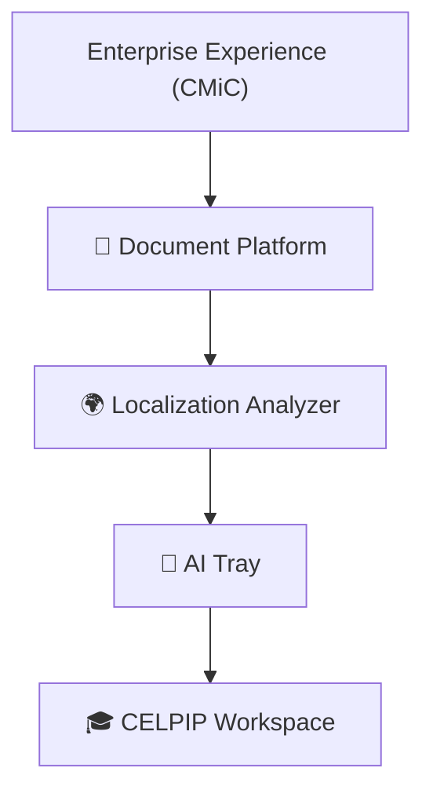

# 👋 Hi, I'm Roshan Shrestha

### Software Engineer • Flutter Architect • Open Source Builder

> **Building software ecosystems—not just apps.**
> I design products, reusable packages, and developer tools that make software easier to build, scale, and maintain.

---

# 🚀 What I Build

Most software starts as an application.

I usually end up building **three things instead**:

- 📱 The product users interact with
- 📦 The reusable packages behind it
- 🛠️ The tooling that makes future development faster

Working on enterprise software at **CMiC** reinforced an important lesson: software succeeds because it's maintainable—not because it shipped one more feature.

That philosophy shapes every project I build. I enjoy creating systems with clean architecture, reusable components, automated quality checks, and excellent developer experience.

---

# 🌐 Open Source Ecosystem

My projects are intentionally connected. Each one solves a problem discovered while building another.

Building enterprise document software exposed localization challenges.

Maintaining reusable packages inspired better tooling.

Managing multiple AI workflows led to AI Tray.

The same engineering principles now power CELPIP Workspace.

Rather than unrelated repositories, these projects represent a growing ecosystem focused on building better software.

---

# ⭐ Featured Projects

| Project                      | Purpose                                                                                                                                           | Technologies                                    |
| ---------------------------- | ------------------------------------------------------------------------------------------------------------------------------------------------- | ----------------------------------------------- |
| 🤖 **AI Tray**               | Cross-platform desktop application for monitoring and managing AI CLI usage directly from the system tray while improving developer productivity. | Flutter • Desktop • Native Integration          |
| 📄 **Document Platform**     | Modular Flutter ecosystem for enterprise document management built around reusable packages and clean architecture.                               | Flutter • Clean Architecture • Modular Packages |
| 🌍 **Localization Analyzer** | Complete localization toolkit including analyzer rules, custom lints, CLI utilities, DevTools integration, and CI validation.                     | Dart Analyzer • CLI • DevTools • CI             |
| 🎓 **CELPIP Workspace**      | Cross-platform learning workspace designed to help learners prepare efficiently for the CELPIP examination.                                       | Flutter • Cross-platform • Riverpod             |

---

# 🛠 Tech Stack

| Area                  | Technologies                                                  |
| --------------------- | ------------------------------------------------------------- |
| **Languages**         | Dart • Java • JavaScript • Python • C++ • C# • Kotlin • Swift |
| **Cross-Platform**    | Flutter (Android • iOS • Web • Windows • macOS)               |
| **State Management**  | Riverpod • Bloc • Provider • GetX                             |
| **Backend & Storage** | Firebase • Supabase • REST APIs • Hive • Isar • Sqflite       |
| **Developer Tooling** | Custom Analyzer Rules • CLI Utilities • DevTools Extensions   |
| **Testing**           | Unit Testing • Widget Testing • Golden Testing                |
| **CI/CD**             | GitHub Actions • Codemagic • Jenkins                          |
| **Design**            | Material 3 • Cupertino • Figma                                |

---

# 💡 Engineering Principles

Software should be easy to understand, easy to test, and easy to evolve.

I believe architecture is less about abstraction and more about helping future developers confidently make changes. Every package, test, documentation page, and CI workflow is an investment in long-term maintainability.

My priorities are:

- Build reusable systems over one-off solutions
- Automate repetitive work
- Keep codebases modular and scalable
- Document important decisions
- Catch problems early through testing and CI
- Improve developer experience wherever possible

---

# 🎯 Current Focus

Currently exploring and building:

- 📦 Production-ready Flutter packages
- 🛠 Developer productivity tools
- 🖥 Desktop applications
- 🌐 Flutter Web experiences
- 🤖 AI-assisted development workflows
- 🏗 Enterprise application architecture
- 📚 Documentation-first engineering

---

# ❤️ Beyond Code

Outside of work and open source, I enjoy:

- 🚴 Cycling
- 🍳 Cooking
- 🌍 Traveling
- 🎧 Music
- 📖 Reading about software architecture and system design

---

# 🤝 Let's Connect

---

### Thanks for stopping by! 👋

I enjoy turning ideas into polished software—whether that's an enterprise application, an open-source package, or a developer tool.

**My goal is simple:** build software that is scalable, maintainable, and genuinely useful to both users and developers.

⭐ If you find one of my projects helpful, consider giving it a star.

