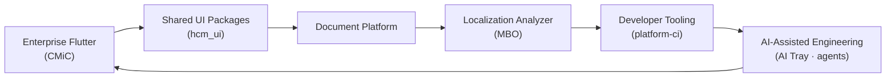
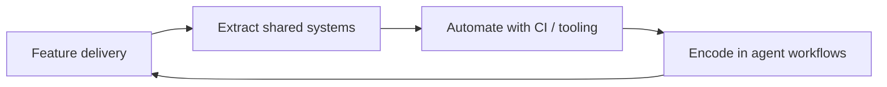

<div align="center">

# Hi, I'm Roshan Shrestha 👋

### Cross-Platform Software Engineer · Flutter Architecture · Developer Tooling & DX

**Building software ecosystems — not just apps.**

<p>

[](https://roshanshrestha.rsprojects.dev/)
[](https://linkedin.com/in/roshandroids)
[](https://github.com/roshandroids)


</p>

</div>

---

## 🚀 What I Build

Most software starts as an application. I usually end up building **three things instead**:

📱 the product people use · 📦 the reusable packages behind it · 🛠️ the tooling that makes the next feature faster

Shipping enterprise HR software at **CMiC** reinforced a simple lesson: software succeeds because it's maintainable — not because it shipped one more feature. That philosophy shapes everything below: clean architecture, reusable components, automated quality gates, and developer experience treated as a product surface, not an afterthought.

---

## 🌐 My Engineering Flywheel

Each project exists because a real problem surfaced while building the one before it — this isn't a portfolio of unrelated repos, it's a compounding system.



Building enterprise document software exposed localization gaps → maintaining shared packages demanded better tooling → managing AI-assisted workflows led to AI Tray and agentic templates → those same principles now power everything I ship next.

---

## ⭐ Featured Projects

| Project | Purpose | Stack |
|---|---|---|
| [**Document Platform**](https://github.com/roshandroids/Document_Platform) | Modular Flutter document-editing monorepo — schema, transactions, codecs, embeddable packages | Flutter · Clean Architecture · Modular Packages |
| [**AI Tray**](https://github.com/roshandroids/AI_Tray) | Cross-platform desktop companion for monitoring & managing AI CLI sessions from the system tray | Flutter Desktop · CLI Integration · Riverpod |
| [**MBO — Localization Analyzer**](https://github.com/roshandroids/MBO) | Full localization diagnostics toolkit — analyzer rules, custom lints, CLI, DevTools integration, CI validation | Dart Analyzer · Custom Lint · CLI · DevTools |
| [**platform-ci**](https://github.com/roshandroids/platform-ci) | Reusable, config-driven GitHub Actions for Flutter/Dart projects | GitHub Actions · CI/CD · Automation |
| [**agentic_flutter_template**](https://github.com/roshandroids/agentic_flutter_template) | AI-first Flutter monorepo template — architecture, CI, and agent workflows baked in | Flutter · Claude Code · Agent Architecture |
| **CELPIP Workspace** | Cross-platform exam-prep workspace built around structured practice and progress tracking | Flutter · Riverpod · go_router · Supabase |

---

## 🛠 Tech Stack

<table>
<tr>
<td valign="top" width="33%">

### 🟢 Core
- Dart · Flutter
- Riverpod
- Feature-first architecture
- REST / Dio integration
- Git · Conventional Commits · Jira

</td>
<td valign="top" width="33%">

### 🔵 Strong
- GitHub Actions · **platform-ci**
- Melos workspaces · FVM
- Flutter Desktop (tray/window)
- Localization engineering
- Unit · Widget · Golden testing
- Firebase / Supabase · Hosting

</td>
<td valign="top" width="33%">

### 🟡 Building Toward
- Go backend engineering
- PostgreSQL · Docker
- Distributed systems & Redis
- Swift / SwiftUI
- Cloud infrastructure

</td>
</tr>
</table>

**Also in the toolbox:** Bloc/Provider/GetX · TypeScript · React · Vite · Tailwind · Hive/Isar/Sqflite · Codemagic/Jenkins · Figma

---

## 🎯 What I Specialize In

| Capability | Signal |
|---|---|
| **Enterprise Flutter delivery** | Production HCM/ATS features — requisitions, applicant tracking, HR documents, deep linking — shipped against real Jira-tracked stories |
| **Existing-codebase investigation** | Tracing features across routing, auth, and data-loading layers of a live production app into accurate, ship-ready feasibility plans |
| **Shared UI & package extraction** | Reusable Flutter component packages (`hcm_ui`) — fields, LOVs, dropzones, document chrome — reused across multiple products |
| **Localization systems** | End-to-end tooling: ARB/l10n at scale, static analysis, custom lints, CI validation — not just string replacement |
| **Developer platform engineering** | Config-driven, reusable CI (`platform-ci`), Melos monorepos, and a multi-agent Claude Code architecture deployed across a dozen repos |
| **AI-assisted engineering** | Agents as part of the delivery loop, not a shortcut — capability-bound tooling that refuses to assume unverified integrations |

---

## 💡 Engineering Principles

```
Build for maintainability
        ↓
Prefer reusable systems over one-off solutions
        ↓
Keep architecture explicit
        ↓
Automate repetitive engineering work
        ↓
Test what matters
        ↓
Document decisions, not just implementation
        ↓
Treat developer experience as part of product quality
```

---

## 🔁 How I Work



---

## 🧭 Identity

**Primary** — Cross-Platform Software Engineer: Flutter · shared UI systems · developer tooling

<details>
<summary><b>Alternative framings</b></summary>
<br>

- Enterprise Flutter Engineer — HCM, Applicant Tracking, HR Documents
- Flutter Platform & DX Engineer — packages, localization tooling, CI
- Product-minded Flutter Engineer — desktop companions & document platforms
- Cross-platform Engineer in transition toward backend & systems ownership (Go, PostgreSQL)

</details>

---

## 📈 Trajectory

Expanding from strong Flutter client/platform work into **backend engineering (Go, PostgreSQL, Docker)** and deeper **systems ownership** — not abandoning Flutter, but building the ability to own a product end-to-end: client, backend, infrastructure, tooling, and delivery.

---

## ❤️ Beyond Code

🚴 Cycling · 🍳 Cooking · 🌍 Traveling · 🎧 Music · 📖 Reading about architecture & systems design

---

<div align="center">

### Let's Connect

[](https://roshanshrestha.rsprojects.dev/)
[](https://linkedin.com/in/roshandroids)
[](https://github.com/roshandroids)

⭐ If one of these projects helps you, a star goes a long way.

<sub>Evidence-based profile · synthesized from ongoing engineering work · updated 2026-08</sub>

</div>
