<div align="center">

# Hi, I'm Roshan Shrestha 👋

### Cross-Platform Software Engineer · Flutter Architecture · Developer Tooling & DX

**Building software ecosystems — not just apps.**

<p>

[](https://roshanshrestha.rsprojects.dev/)
[](https://linkedin.com/in/roshandroids)
[](https://github.com/roshandroids)


</p>

</div>

---

## 🚀 What I Build

Most software starts as an application. I usually end up building **three things instead**:

📱 the product people use · 📦 the reusable packages behind it · 🛠️ the tooling that makes the next feature faster

Shipping enterprise Flutter software in production reinforced a simple lesson: software succeeds because it's maintainable — not because it shipped one more feature. That philosophy shapes everything below: clean architecture, reusable components, automated quality gates, and developer experience treated as a product surface, not an afterthought.

<div align="center">
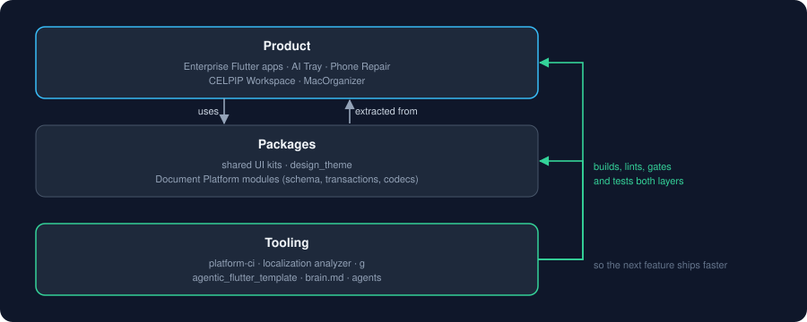
</div>

---

## 🌐 My Engineering Flywheel

Each project exists because a real problem surfaced while building the one before it — this isn't a portfolio of unrelated repos, it's a compounding system.

<div align="center">
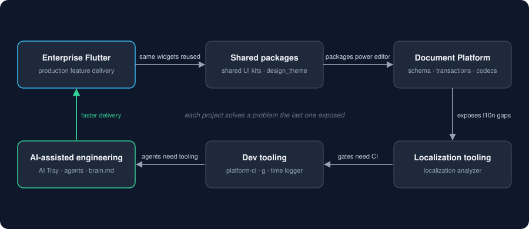
</div>

Building enterprise document software exposed localization gaps → maintaining shared packages demanded better tooling → managing AI-assisted workflows led to AI Tray, `brain.md`, and agentic templates → those same principles now power everything I ship next.

---

## ⭐ Featured Projects

| Project | Purpose | Stack |
|---|---|---|
| [**Document Platform**](https://github.com/roshandroids/Document_Platform) | Modular Flutter document-editing monorepo — schema, transactions, codecs, embeddable packages | Flutter · Clean Architecture · Modular Packages |
| [**AI Tray**](https://github.com/roshandroids/AI_Tray) | Menu-bar / system-tray companion that tracks **Claude Code** and **GitHub Copilot** usage (session & weekly rings, provider health). v1.3.3, multi-provider architecture, macOS arm64 supported | Flutter Desktop · Provider Platform · Riverpod |
| **Localization analyzer** | Catches localization bugs while coding: hardcoded strings, missing / duplicate / unused ARB keys. Pure-Dart engine, CLI-first, CI gate, DevTools console, baseline so old debt is tolerated and new debt fails | Dart Analyzer · Custom Lint · CLI · DevTools |
| [**platform-ci**](https://github.com/roshandroids/platform-ci) | Reusable, config-driven GitHub Actions for Flutter/Dart — apps, Melos monorepos, packages, CLI, web, desktop, mobile, Firebase, Pages, pub.dev | GitHub Actions · CI/CD · Automation |
| [**agentic_flutter_template**](https://github.com/roshandroids/agentic_flutter_template) | AI-first Flutter monorepo template — feature-first Clean Architecture, Melos, modular CI, and agent workflows baked in | Flutter · Claude Code · Agent Architecture |
| **brain.md** | Open, agent-agnostic standard + zero-dependency CLI that gives coding agents a persistent, repo-resident memory in plain Markdown | CLI · Markdown · Agent tooling |
| [**g**](https://github.com/roshandroids/g) | Small CLI that wraps `git`/GitHub for the sequences I repeat daily (branch from a ticket key, conventional commit) — native git stays the escape hatch | CLI · Git |
| [**MacOrganizer**](https://github.com/roshandroids/MacOrganizer) | Native macOS utility to declutter Downloads/Desktop without ever permanently deleting anything; ported from a Python prototype | Swift · SwiftUI · CI |
| [**design_theme**](https://github.com/roshandroids/design_theme) | Material 3 tokens, ThemeData adapters and composite widget themes with a live playground | Flutter · Design System |
| [**Phone Repair**](https://github.com/roshandroids/phone_repair) | Multi-role repair platform (customer, shop, admin) from one Flutter codebase across mobile, web and desktop; ADR-driven, auth in place | Flutter · go_router · ADRs |
| **CELPIP Workspace** | Cross-platform exam-prep workspace built around structured practice and progress tracking | Flutter · Riverpod · go_router · Supabase |

<details>
<summary><b>More experiments</b></summary>
<br>

- [**custom-navigation-voice-generator**](https://github.com/roshandroids/custom-navigation-voice-generator) — benchmark of open-source TTS engines on Nepali / English navigation instructions, toward personalized Waze voices
- [**go-backend-learning**](https://github.com/roshandroids/go-backend-learning) — real code, tests and commits documenting my move from Flutter into production Go
- [**roshan_portfolio**](https://github.com/roshandroids/roshan_portfolio) · [**rsprojects-showcase**](https://github.com/roshandroids/rsprojects-showcase) — portfolio and project showcase sites
- [**semantics_coverage**](https://github.com/roshandroids/semantics_coverage) — Flutter accessibility-semantics coverage experiment

</details>

---

## 🔬 Case Study: Localization as an Engineering Problem

Hardcoded strings ship to French users as English forever, until QA or a customer notices. The defect is *static*, so an analyzer can see it. One engine, three consumers:

<div align="center">
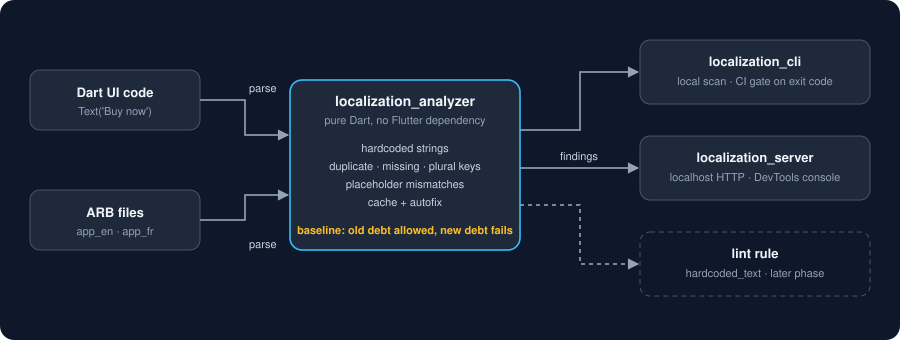
</div>

The baseline is the adoption trick: existing debt is recorded and allowed, so the gate can go live on a legacy codebase on day one and only new violations fail.

---

## 🧩 Project Deep Dives

One diagram per project, each showing the mechanism rather than the name. Expand what interests you.

<details>
<summary><b>AI Tray</b> — usage rings for Claude Code and Copilot in the menu bar</summary>
<br>

Provider adapters turn CLI output (Claude) and an SDK sidecar (Copilot, experimental) into validated usage; a repository caches it and notifiers drive the rings. Sessions are read straight from `~/.claude/projects`, and queued resumes require a budget cap.

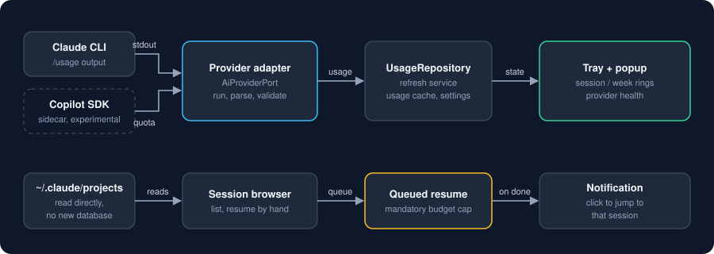

</details>

<details>
<summary><b>MacOrganizer</b> — native SwiftUI declutter tool that never deletes</summary>
<br>

A thin SwiftUI shell over `OrganizerCore`, a SwiftPM engine tested without Xcode (57 tests). Every move goes to Trash and is journaled by device and inode, which is what makes a whole run undoable.

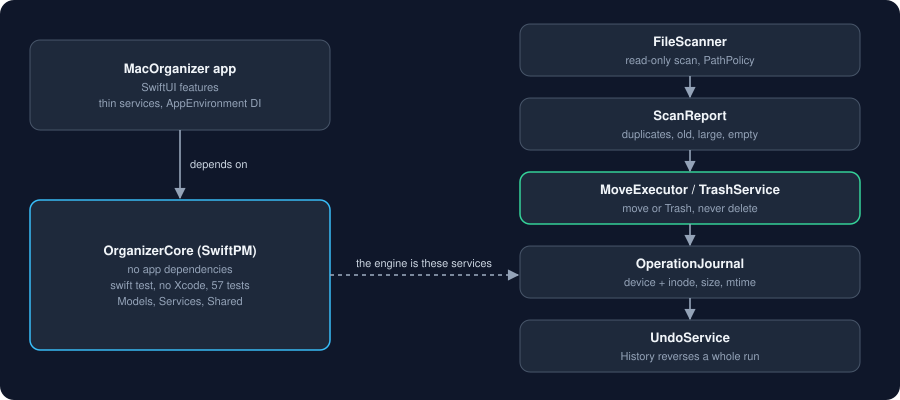

</details>

<details>
<summary><b>Phone Repair</b> — one Flutter codebase for customer, shop and admin</summary>
<br>

Session-aware routing, Riverpod controllers, repository interfaces, Supabase behind them, and ADRs for each foundational call. Auth and the identity schema are in; the product workflows are still pending.

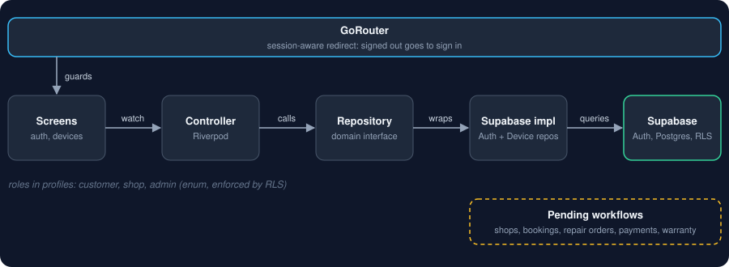

</details>

<details>
<summary><b>agentic_flutter_template</b> — monorepo where AI instructions have one home</summary>
<br>

Feature-first Clean Architecture with `packages/` and pluggable `modules/`. Claude Code, Cursor and Copilot files are thin pointers to a single `.ai/AGENTS.md`.

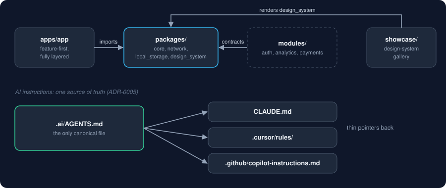

</details>

<details>
<summary><b>Localization analyzer</b> — localization defects found while coding</summary>
<br>

One pure-Dart engine feeds a CLI and CI gate, a localhost server for a DevTools console, and a planned lint rule. A baseline lets the gate go live on legacy code.


</details>

<details>
<summary><b>platform-ci</b> — reusable GitHub Actions for Flutter and Dart</summary>
<br>

Consumers describe intent in `ci.yaml` and pin `@v1`. Only quality runs by default; builds, releases, deploys and pub.dev publishing are opt-in.

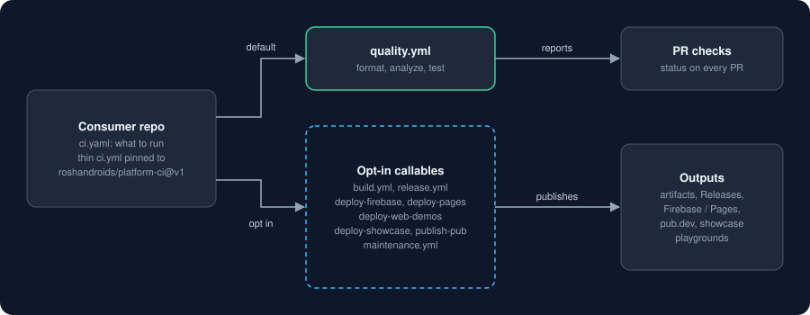

</details>

<details>
<summary><b>semantics_coverage</b> — find widgets automation cannot address</summary>
<br>

A fast static scan and a runtime semantics-tree scan feed one coverage number, a CI gate, and chunked task lists sized so an agent never needs the whole app in context.

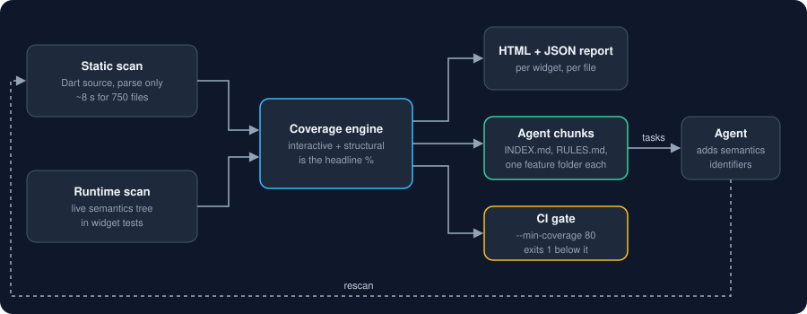

</details>

<details>
<summary><b>design_theme</b> — one theme object for Material 3 apps</summary>
<br>

A seed colour builds light and dark `DesignTheme` tokens, adapted to `ThemeData` and shared with composite widgets through `DesignTheme.of(context)`. A switcher overrides it per subtree.

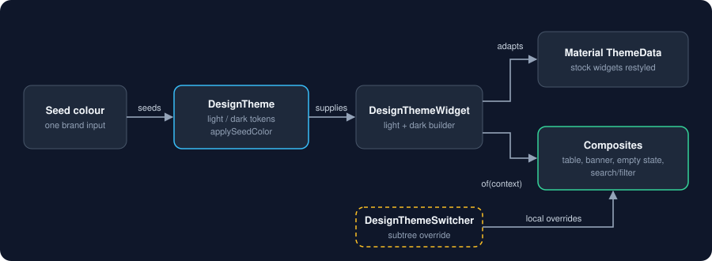

</details>

<details>
<summary><b>g</b> — a Git workflow CLI in Go</summary>
<br>

Wraps the installed `git` instead of reimplementing it: ticket-keyed branch names, conventional commit messages, short output. Native git stays the escape hatch.

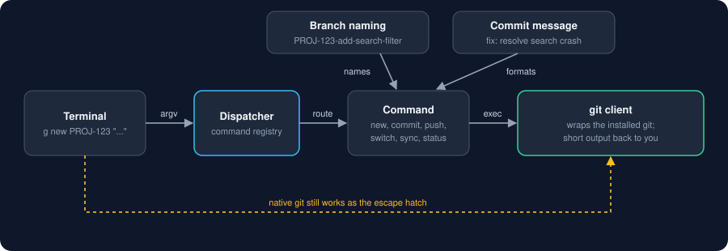

</details>

<details>
<summary><b>log-time</b> — weekly time logging through a local web page</summary>
<br>

Claude fetches issue-tracker and calendar data, a localhost-only server renders a week grid, and request files hand Refresh and Submit clicks back to Claude. Nothing posts until you submit.

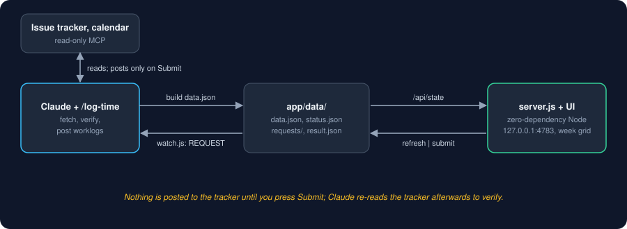

</details>

<details>
<summary><b>TTS benchmark</b> — choosing a Nepali navigation voice engine</summary>
<br>

A standard phrase corpus runs through swappable engine adapters. Missing engines are skipped and recorded instead of blocking the run, and each result captures timing, audio info and errors.

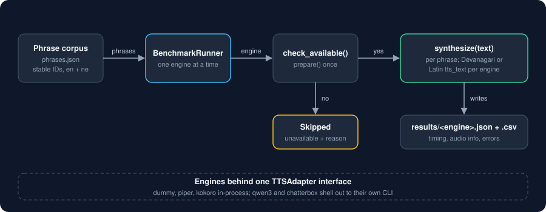

</details>

<details>
<summary><b>brain.md</b> — repo-resident memory for coding agents</summary>
<br>

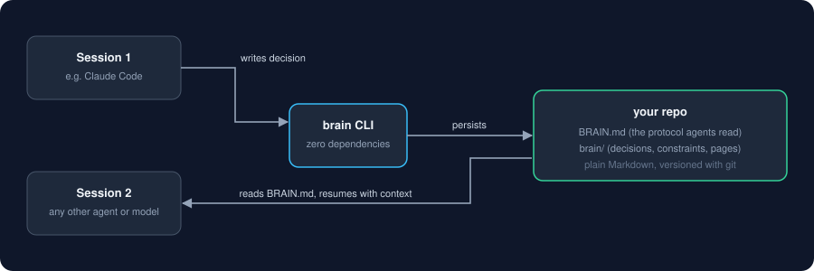

</details>

<details>
<summary><b>Project showcase</b> — a registry-driven portal for every product</summary>
<br>

Each product repo stays the source of truth. An integration definition is validated and compiled into a registry the Flutter Web showcase renders, and `platform-ci` publishes private playgrounds into it.

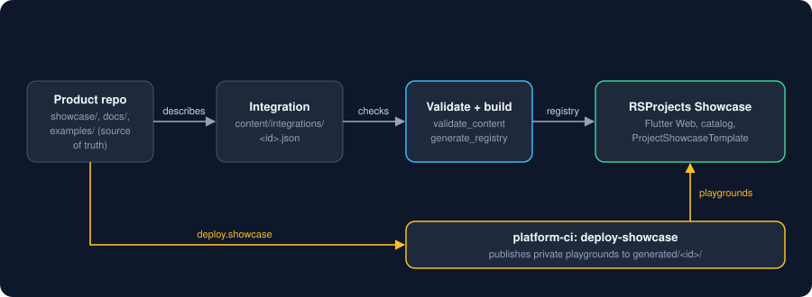

</details>

<details>
<summary><b>Portfolio site</b> — React 19, Vite and Firebase</summary>
<br>

Terminal-first hero, GitHub metrics synced daily as static JSON, a command palette and a hidden `/terminal`. Push to `main` deploys; every PR gets a preview channel.

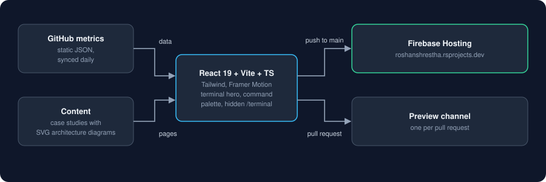

</details>

<details>
<summary><b>Go backend (in progress)</b> — real-time chat as the learning target</summary>
<br>

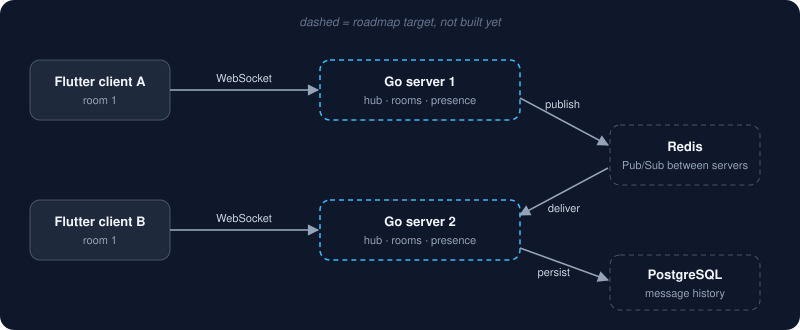

</details>

---

## 🛠 Tech Stack

<table>
<tr>
<td valign="top" width="33%">

### 🟢 Core
- Dart · Flutter
- Riverpod
- Feature-first Clean Architecture
- REST / Dio integration
- Git · Conventional Commits · Jira

</td>
<td valign="top" width="33%">

### 🔵 Strong
- GitHub Actions · **platform-ci**
- Melos workspaces · FVM
- Flutter Desktop (tray/window)
- Dart analyzer, custom lints, CLI design
- Localization engineering
- Claude Code agents, skills, MCP
- Unit · Widget · Golden testing
- Firebase / Supabase · Hosting

</td>
<td valign="top" width="33%">

### 🟡 Building Toward
- Go backend engineering (WebSockets, hub pattern)
- PostgreSQL · Docker
- Distributed systems & Redis
- Swift / SwiftUI (first native app shipped: MacOrganizer)
- Cloud infrastructure

</td>
</tr>
</table>

**Also in the toolbox:** Bloc/Provider/GetX · TypeScript · React · Vite · Tailwind · Laravel · Hive/Isar/Sqflite · Codemagic/Jenkins · Figma · TTS / audio experiments

---

## 🎯 What I Specialize In

| Capability | Signal |
|---|---|
| **Enterprise Flutter delivery** | Production enterprise features — workflow-heavy screens, document handling, deep linking — shipped against tracked stories |
| **Existing-codebase investigation** | Tracing features across routing, auth, and data-loading layers of a live production app into accurate, ship-ready feasibility plans |
| **Shared UI & package extraction** | Reusable Flutter component packages (shared UI kits, `design_theme`) — fields, pickers, dropzones, document chrome, theme tokens — reused across multiple products |
| **Localization systems** | End-to-end tooling: ARB/l10n at scale, static analysis, custom lints, baseline-aware CI validation — not just string replacement |
| **Developer platform engineering** | Config-driven, reusable CI (`platform-ci`), Melos monorepos, small CLIs (`g`), and a multi-agent Claude Code architecture reused across many repos |
| **AI-assisted engineering** | Agents as part of the delivery loop, not a shortcut — capability-bound tooling that refuses to assume unverified integrations, plus persistent agent memory (`brain.md`) |
| **Native & desktop apps** | Flutter Desktop (AI Tray) and native SwiftUI (MacOrganizer) utilities that respect platform conventions |

### How the agent system works

One roster, one shared skill set, reused by every repo. The coordinator only routes; specialists do the work; review can bounce work back.

<div align="center">
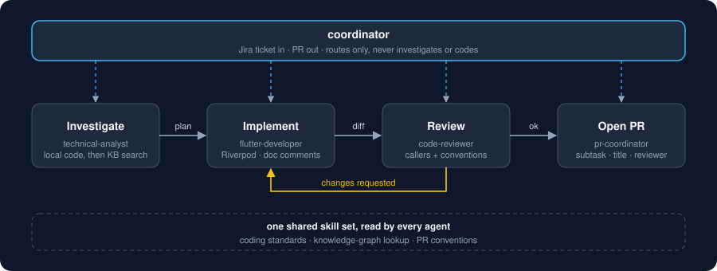
</div>

Agent sessions forget; `brain.md` is the fix. Decisions go through a small CLI into Markdown in the repo, so the next session, even from a different agent, resumes with context.

<div align="center">

</div>

---

## 🏆 Highlights

- **Localization analyzer reached "MVP trusted"** (2026-07-10) after a CLI-first pivot, with CI and ADRs
- **AI Tray at v1.3.3** with a provider-platform architecture supporting two AI vendors, ~120 commits
- **platform-ci released** as versioned reusable workflows covering every Flutter target plus pub.dev
- **Multi-agent Claude Code system** (coordinator + 5 specialists, one shared skill set) reused across many repos
- **Shipped a native SwiftUI app** from a Python prototype, with CI, in a language outside my main stack

---

## 💡 Engineering Principles

```
Build for maintainability
        ↓
Prefer reusable systems over one-off solutions
        ↓
Keep architecture explicit
        ↓
Automate repetitive engineering work
        ↓
Test what matters
        ↓
Document decisions, not just implementation
        ↓
Treat developer experience as part of product quality
```

---

## 🔁 How I Work

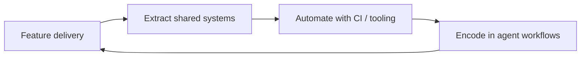
```mermaid
flowchart LR
  A[Feature delivery] --> B[Extract shared systems]
  B --> C[Automate with CI / tooling]
  C --> D[Encode in agent workflows]
  D --> A
```

---

## 🧭 Identity

**Primary** — Cross-Platform Software Engineer: Flutter · shared UI systems · developer tooling

<details>
<summary><b>Alternative framings</b></summary>
<br>

- Enterprise Flutter Engineer — workflow-heavy business apps, shared UI systems
- Flutter Platform & DX Engineer — packages, localization tooling, CI
- Developer-tools Engineer — analyzers, CLIs, agent infrastructure
- Product-minded Flutter Engineer — desktop companions & document platforms
- Cross-platform Engineer in transition toward backend & systems ownership (Go, PostgreSQL)

</details>

---

## 📈 Trajectory

Expanding from strong Flutter client/platform work into **backend engineering (Go, PostgreSQL, Docker)** and deeper **systems ownership** — not abandoning Flutter, but building the ability to own a product end-to-end: client, backend, infrastructure, tooling, and delivery.

The concrete target is a real-time chat backend, learned through a challenge ladder from "connect Flutter to Go" up to "run two servers behind Redis and survive killing one":

<div align="center">

</div>

---

## ❤️ Beyond Code

🚴 Cycling · 🍳 Cooking · 🌍 Traveling · 🎧 Music · 📖 Reading about architecture & systems design

---

<div align="center">

### Let's Connect

[](https://roshanshrestha.rsprojects.dev/)
[](https://linkedin.com/in/roshandroids)
[](https://github.com/roshandroids)

⭐ If one of these projects helps you, a star goes a long way.

<sub>Evidence-based profile · synthesized from ongoing engineering work · updated 2026-10</sub>

</div>
